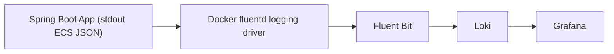

# SpringBoot Template JWT API

基于 Spring Boot 4 + Kotlin + Sa-Token JWT + Jimmer 的后端开发模板，内置用户/角色/权限管理、统一响应、结构化请求日志、Swagger 文档，以及一套开箱即用的 Loki + Grafana 日志观测方案。

## 1. 项目概览

这个仓库更像一个“可直接扩展的后端骨架”，重点放在下面几件事：

- 用户、角色、权限三类基础 RBAC 能力已经拆好接口和数据模型
- 认证基于 Sa-Token + JWT，适合前后端分离 API 服务
- 默认 `dev` 环境可用本地 H2 文件数据库兜底，方便快速启动
- `prod` 环境默认输出 ECS 风格结构化 JSON 日志
- 仓库已经附带单机和双机的日志观测部署文件

## 2. 技术栈

| 类别 | 方案 | 当前版本/说明 |
|---|---|---|
| 核心框架 | Spring Boot | 4.0.5 |
| 编程语言 | Kotlin | 2.2.21 |
| JDK | Java Toolchain | 21 |
| 认证授权 | Sa-Token + JWT | 1.45.0 |
| ORM | Jimmer | 0.10.6 |
| API 文档 | SpringDoc OpenAPI | 3.0.3 |
| Web | Spring MVC | `spring-boot-starter-web` |
| 数据库 | PostgreSQL / H2 | PostgreSQL 为生产推荐，H2 为本地兜底 |
| 缓存 | Redis | Spring Data Redis |
| 监控指标 | Spring Boot Actuator + Micrometer Prometheus | `/actuator/prometheus` |
| Trace Context | Spring Boot OpenTelemetry Starter | 默认只保留 trace context，不默认导出到 OTLP |
| 日志观测 | Fluent Bit + Loki + Grafana | 仓库内已带部署与预置 Dashboard |

## 3. 代码结构

```text
src/
├── main/
│   ├── kotlin/com/app/
│   │   ├── config/                  # 异常、Swagger、Sa-Token 等配置
│   │   ├── controller/              # API 控制器
│   │   ├── data/                    # DTO / 响应体 / 请求体
│   │   ├── filter/                  # 请求日志、限流、跨域等过滤器
│   │   ├── repository/              # 数据访问层
│   │   ├── service/                 # 业务逻辑
│   │   └── logging/                 # 日志上下文辅助
│   └── resources/
│       ├── application.yml          # 通用配置，默认 dev
│       ├── application-prod.yml     # 生产配置，开启结构化日志
│       ├── application-dev.yml      # 开发配置
│       ├── db/*.sql                 # 初始化 SQL
│       └── logback-spring.xml       # 日志输出配置
└── test/

observability/
├── docker-compose.yml               # 单机演示：app + redis + fluent-bit + loki + grafana
├── docker-compose.node.yml          # 业务节点：app + fluent-bit
├── docker-compose.monitoring.yml    # 中心监控：loki + grafana
├── fluent-bit/
├── grafana/
└── loki/
```

## 4. 核心能力

### 4.1 认证与授权

- `POST /api/auth/register`
- `POST /api/auth/login`
- `POST /api/auth/logout`
- `POST /api/user/list`
- `POST /api/user/create`
- `POST /api/role/list`
- `POST /api/role/create`
- `POST /api/role/assign-to-user`
- `POST /api/permission/list`
- `POST /api/permission/create`
- `POST /api/permission/assign-to-role`

### 4.2 请求处理与统一约束

- 统一响应包装：`RespBean`
- 统一异常处理：`GlobalExceptionHandler`
- 请求日志：`RequestLogFilter`
- 限流：`FlowLimitingFilter`
- 跨域：`CorsFilter`
- Swagger/OpenAPI：默认开启

### 4.3 数据源策略

项目默认并不是“必须先连上 PostgreSQL 才能启动”。

- `application.yml` 内置了 H2 文件数据库兜底：
  - 数据文件：`./db/demo`
  - 方言默认：H2
- 只要提供外部数据库配置，Spring 会覆盖这套默认值：
  - 环境变量
  - 命令行参数
  - `./config/application.yml`

因此：

- 本地快速开发可以先用 H2
- 联调或生产建议切到 PostgreSQL，并同步覆盖 Jimmer 方言和校验模式

## 5. 本地开发

### 5.1 前置条件

- JDK 21
- Redis
- 可选：PostgreSQL

### 5.2 最小启动方式

如果你只想先把项目跑起来，最小依赖是：

1. 准备 Redis
2. 覆盖默认 Redis 配置
3. 直接启动应用

默认 `application.yml` 里的 Redis Host 是占位值 `xxx`，本地必须覆盖，例如：

```powershell
$env:SPRING_DATA_REDIS_HOST="127.0.0.1"
$env:SPRING_DATA_REDIS_PORT="6379"
.\gradlew.bat bootRun
```

Linux / macOS：

```bash
SPRING_DATA_REDIS_HOST=127.0.0.1 \
SPRING_DATA_REDIS_PORT=6379 \
./gradlew bootRun
```

### 5.3 使用 PostgreSQL

如果你不想使用默认 H2，可以覆盖以下配置：

```bash
SPRING_DATASOURCE_DRIVER_CLASS_NAME=org.postgresql.Driver
SPRING_DATASOURCE_URL=jdbc:postgresql://127.0.0.1:5432/springboot_template
SPRING_DATASOURCE_USERNAME=app_user
SPRING_DATASOURCE_PASSWORD=change-me
JIMMER_DIALECT=org.babyfish.jimmer.sql.dialect.PostgresDialect
JIMMER_DATABASE_VALIDATION_MODE=ERROR
```

### 5.4 常用命令

Windows：

```powershell
.\gradlew.bat bootRun
.\gradlew.bat test
.\gradlew.bat spotlessApply
```

Linux / macOS：

```bash
./gradlew bootRun
./gradlew test
./gradlew spotlessApply
```

### 5.5 常用访问地址

- 应用：`http://localhost:18080`
- Swagger UI：`http://localhost:18080/swagger-ui.html`
- H2 Console：`http://localhost:18080/h2-console`
- Health：`http://localhost:18080/actuator/health`
- Prometheus 指标：`http://localhost:18080/actuator/prometheus`

## 6. 配置与运行时说明

### 6.1 Profile

- 默认 profile：`dev`
- `dev` 分组：`docs,satoken`
- `prod` 分组：`docs,satoken`

### 6.2 prod 环境特点

`application-prod.yml` 当前有几个很重要的行为：

- 控制台日志输出为 ECS JSON
- 日志保留 `traceId / spanId / reqId`
- 暴露 `health, info, prometheus`
- `management.tracing.export.enabled=false`
- `management.otlp.metrics.export.enabled=false`

这意味着：

- 当前仓库已经有 trace context，但默认**不会**把 traces / metrics 发送到 OTLP Receiver
- 如果你要接 OpenTelemetry Collector，需要额外部署 Collector，并通过外部配置重新打开导出

## 7. Observability

这一节是当前仓库最值得单独说明的部分。仓库里的日志观测方案不是“示例草图”，而是一套已经和代码、Compose、Grafana Dashboard 对齐过的完整落地方案。

### 7.1 当前实现了什么

#### 日志

- `prod` 环境输出 ECS 风格结构化 JSON 日志
- 请求开始与请求结束由 `RequestLogFilter` 统一记录
- 业务异常、权限异常、参数异常、运行时异常由 `GlobalExceptionHandler` 统一记录
- 日志里带 `traceId / spanId / reqId`
- 请求完成日志里带 `event.* / http.* / url.path / user.id / duration_ms`

#### 指标

- 应用已经引入 `spring-boot-starter-actuator`
- 应用已经引入 `micrometer-registry-prometheus`
- 当前默认暴露 `/actuator/prometheus`
- 仓库内没有附带 Prometheus 容器；也就是说指标目前是“可被抓取”，但不是“已被完整接入 Grafana”

#### Trace

- 已引入 `spring-boot-starter-opentelemetry`
- 默认保留 trace context，让日志里出现 `traceId / spanId`
- 默认关闭 OTLP trace / metrics 导出

因此当前项目的默认观测重点是：

- 日志：已完整落地
- 指标：已暴露 Prometheus 格式
- Trace：已保留上下文，但默认未接后端

### 7.2 观测链路

当前日志链路如下：



关键点：

- 应用不是“主动推给 Fluent Bit”
- Fluent Bit 也不是直接读本地日志文件
- 当前方案使用 Docker `fluentd` logging driver，把容器 stdout 直接转发给 Fluent Bit 的 `forward` input

### 7.3 关键代码与配置如何配合

#### 应用侧

- `src/main/resources/application.yml`
  - 默认 `dev`
  - H2 兜底
  - Redis 占位配置需要外部覆盖
- `src/main/resources/application-prod.yml`
  - ECS 结构化日志
  - `traceId / spanId / reqId` 关联模式
  - Actuator 暴露 `prometheus`
  - OTLP export 默认关闭
- `src/main/kotlin/com/app/filter/RequestLogFilter.kt`
  - 生成 `reqId`
  - 通过 `X-Request-Id` 回传给客户端
  - 记录 `request.start` / `request.complete`
- `src/main/kotlin/com/app/config/exception/GlobalExceptionHandler.kt`
  - 统一输出 `event.category=error`
  - 统一写入 `http.response.status_code`
  - 保留异常 cause，方便日志面板查看原始错误

#### 采集侧

- `observability/fluent-bit/parsers.yml`
  - 用 `ecs_json` 解析应用输出的 JSON 日志
- `observability/fluent-bit/fluent-bit.yml`
  - 单机模式，把日志推到本地 `loki:3100`
  - 固定 labels：`job/service/environment/node=standalone`
- `observability/fluent-bit/fluent-bit-node.yml`
  - 双机模式，通过环境变量发往中心 Loki
  - `node=${NODE_NAME}` 用于区分业务节点

#### 存储与展示侧

- `observability/loki/config.yml`
  - 单机文件存储
  - 开启 `allow_structured_metadata`
- `observability/grafana/provisioning/datasources/loki.yml`
  - 预置默认 Loki 数据源，UID 固定为 `loki`
- `observability/grafana/provisioning/dashboards/dashboard-provider.yml`
  - 自动加载 `Observability` 文件夹下的预置 Dashboard
  - 15 秒轮询一次本地 JSON 文件

另外两点值得单独说明：

- 观测栈镜像版本在 Compose 里已经固定：
  - `Redis 8.6.2-alpine`
  - `Fluent Bit 5.0.3`
  - `Grafana Loki 3.7.1`
  - `Grafana 13.0.1`
- `observability/` 下的关键配置文件都带有“来源注释清单”，直接把官方文档链接写在配置头部，便于后续维护时追溯参数来源

### 7.4 单机演示部署

单机演示编排文件：

- `observability/docker-compose.yml`

它会启动：

- `app`
- `redis`
- `fluent-bit`
- `loki`
- `grafana`

启动命令：

```bash
docker compose -f observability/docker-compose.yml up --build -d
```

访问地址：

- App：`http://localhost:18080`
- Grafana：`http://localhost:3000`

默认账号：

- 用户名：`admin`
- 密码：`admin123456`

### 7.5 双机拆分部署

仓库里提供了面向生产形态的拆分编排：

#### 业务节点

- 文件：`observability/docker-compose.node.yml`
- 启动内容：`app + fluent-bit`
- 依赖：共享 PostgreSQL、共享 Redis、中心 Loki

示例环境文件：

- `observability/.env.node.example`

关键变量：

- `NODE_NAME=node-a` / `node-b`
- `SPRING_DATASOURCE_*`
- `SPRING_DATA_REDIS_*`
- `JIMMER_DIALECT`
- `JIMMER_DATABASE_VALIDATION_MODE`
- `LOKI_HOST`
- `LOKI_PORT`

启动：

```bash
cp observability/.env.node.example observability/.env.node
docker compose --env-file observability/.env.node -f observability/docker-compose.node.yml up --build -d
```

#### 监控中心

- 文件：`observability/docker-compose.monitoring.yml`
- 启动内容：`loki + grafana`

示例环境文件：

- `observability/.env.monitoring.example`

启动：

```bash
cp observability/.env.monitoring.example observability/.env.monitoring
docker compose --env-file observability/.env.monitoring -f observability/docker-compose.monitoring.yml up -d
```

注意：

- 如果直接运行 `docker-compose.monitoring.yml` 而**不提供 env file**，Grafana 密码默认是 `admin`
- 如果使用仓库附带的 `.env.monitoring.example`，密码是 `admin123456`

### 7.6 Grafana 预置 Dashboard

预置 Dashboard 名称：

- `SpringBoot Template JWT API Overview`

它当前已经支持：

- 顶部按 `Node` 筛选
- 顶部按 `Level` 筛选
- 顶部按 `TraceId / SpanId / ReqId / URL Path` 筛选
- 摘要化展示日志，而不是大段 JSON
- 点开日志详情后，在 `Parsed fields` 顶部直接看到 `_raw_json`

换句话说：

- 面板里看的是“人能扫一眼看懂”的摘要
- 点开以后仍然能复制完整原始 JSON

### 7.7 Dashboard 当前的日志摘要格式

当前日志面板统一压缩成类似下面的样子：

```text
action=request.complete method=POST path=/api/user/list status=200 outcome=success reqId=2046140597202141184 message=HTTP request completed
```

适合快速查看：

- 时间
- 日志级别
- 请求方法
- 请求路径
- 状态码
- 结果
- 请求 ID
- 摘要信息

### 7.8 当前可直接搜索的字段

代码和 Dashboard 当前已经对齐好的重点字段有：

- `traceId`
- `spanId`
- `reqId`
- `url.path`
- `event.action`
- `event.category`
- `event.outcome`
- `http.request.method`
- `http.response.status_code`
- `user.id`
- `message`

### 7.9 Explore 中常用 LogQL

查看所有当前服务日志：

```logql
{job="springboot-template-jwt-api"} | json
```

查看某个节点：

```logql
{job="springboot-template-jwt-api",node="node-a"} | json
```

查看请求完成日志：

```logql
{job="springboot-template-jwt-api"} | json action="event.action" | action="request.complete"
```

查看 4xx：

```logql
{job="springboot-template-jwt-api"} | json status="http.response.status_code" | status=~"4.."
```

查看 5xx：

```logql
{job="springboot-template-jwt-api"} | json status="http.response.status_code" | status=500
```

查看某个请求：

```logql
{job="springboot-template-jwt-api"} | json req_id="reqId" | req_id="2046140597202141184"
```

查看某条链路：

```logql
{job="springboot-template-jwt-api"} | json trace_id="traceId" | trace_id="eed35070522d1fbbed8a07f2205994cc"
```

### 7.10 常见排障

#### Grafana 能打开，但看不到预置 Dashboard

优先检查：

- `observability/grafana/provisioning/dashboards/dashboard-provider.yml` 是否被正确挂载
- Grafana 数据卷是否保留了旧 datasource 状态

如果你是在旧版配置基础上切换到当前预置 `uid: loki` 的方案，可能需要清理 Grafana 本地卷后重新启动。

#### Grafana 登录失败

请先区分你用的是哪套编排：

- `observability/docker-compose.yml`
  - `admin / admin123456`
- `observability/docker-compose.monitoring.yml`
  - 使用 `.env.monitoring.example` 时：`admin / admin123456`
  - 不提供 env file 时：`admin / admin`

#### 日志面板无数据

优先检查：

- App 是否真的通过 Docker Compose 启动
- App 容器是否启用了 `logging.driver=fluentd`
- Fluent Bit 是否在监听 `24224`
- Loki 是否正常启动
- 顶部 `Node` 筛选是否选错

#### OTLP 连接拒绝

如果你看到应用尝试访问 `http://localhost:4318/v1/metrics` 或类似地址报错，说明你打开了 OTLP 导出，但并没有部署 OTLP Receiver。

当前仓库默认就是关闭这部分导出的，想启用请先部署 Collector。

### 7.11 如果要接 OpenTelemetry

当前仓库默认并没有完整启用 OTel 后端，只保留了 trace context。

如果要进一步升级为完整 OpenTelemetry 方案，推荐最小路径：

- `OpenTelemetry Collector`
- `Tempo`
- `Prometheus`
- `Loki`
- `Grafana`

建议迁移顺序：

1. 先保留当前 `Fluent Bit -> Loki -> Grafana` 日志链路不动
2. 新增 `Collector + Tempo` 接 traces
3. 指标继续从 `/actuator/prometheus` 被 Prometheus 抓取
4. 确认 Collector 部署后，再按环境打开 `management.tracing.export.enabled` / `management.otlp.metrics.export.enabled`

## 8. 当前仓库的默认运行模式

如果你不做额外改造，当前仓库推荐按下面理解：

- 本地开发：H2 + Redis + `dev`
- 日志观测演示：`observability/docker-compose.yml`
- 生产部署：外部 PostgreSQL + 外部 Redis + `prod`
- 多节点日志中心：`docker-compose.node.yml` + `docker-compose.monitoring.yml`
- 指标：默认只暴露 `/actuator/prometheus`
- Trace：默认只保留 `traceId / spanId`，不默认导出到后端

## 9. 建议的 README 使用方式

第一次接手这个仓库，建议按下面顺序阅读和验证：

1. 先跑本地开发模式，确认 Redis 配置能覆盖成功
2. 打开 Swagger，熟悉 `/api/auth`、`/api/user`、`/api/role`、`/api/permission`
3. 启动 `observability/docker-compose.yml`
4. 打开 Grafana 预置 Dashboard
5. 通过 `ReqId / TraceId / URL Path` 定位一次真实请求
6. 点开日志详情，复制 `_raw_json` 看原始结构化日志
